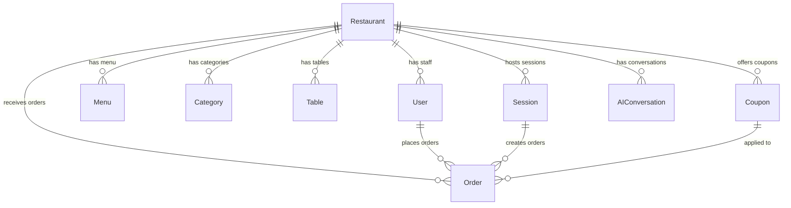

# DineOS — Database Schema Reference

> **Classification:** Internal Engineering Reference
> **ORM:** Mongoose 9.0 | **Database:** MongoDB Atlas
> **Models:** 10 | **Multi-Tenant:** Logical isolation via `restaurantId`

---

## Multi-Tenancy Golden Rule

> **Every query to a tenant-scoped collection MUST include a `restaurantId` filter.**

Use the `buildRestaurantFilter()` utility from `tenantContext.js`:

```javascript
const filter = buildRestaurantFilter(req.restaurantId, { status: 'new' });
const orders = await Order.find(filter);
```

---

## 1. Restaurant (Tenant Core)

> **File:** `backend/src/models/Restaurant.js`
> **Collection:** `restaurants`

This is the **tenant anchor**. Every other tenant-scoped model references this via `restaurantId`.

| Field | Type | Constraints | Default | Description |
| :--- | :--- | :--- | :--- | :--- |
| `name` | String | required, trim | — | Restaurant display name |
| `slug` | String | required, **unique**, lowercase, trim | — | URL-safe identifier (`/r/:slug`) |
| `ownerId` | ObjectId → `User` | required | — | Admin who owns this restaurant |
| `logoUrl` | String | — | `null` | Logo image URL |
| `themeColor` | String | — | `#ff9500` | Primary brand color (orange) |
| `currency` | String | — | `INR` | Currency code |
| `isActive` | Boolean | — | `true` | Tenant status (toggled by SuperAdmin) |
| `tablesCount` | Number | — | `10` | Total tables available |
| `autoPilot` | Boolean | — | `true` | Auto-accept orders flag |
| `isPremium` | Boolean | — | `false` | Subscription tier |
| `subscriptionExpiresAt` | Date | — | `null` | Premium expiry |
| `trialActivatedAt` | Date | — | `Date.now` | Trial start timestamp |
| `loyaltySettings` | Subdocument | — | Defaults below | Loyalty program configuration |
| `loyaltySettings.enabled` | Boolean | — | `true` | Loyalty system active |
| `loyaltySettings.earnRate` | Number | — | `10` | Points earned per ₹100 spent |
| `loyaltySettings.redeemRate` | Number | — | `1` | ₹1 per 10 points |
| `loyaltySettings.minPointsToRedeem` | Number | — | `100` | Minimum points to start redeeming |
| `loyaltySettings.maxRedemptionPercentage` | Number | — | `50` | Max bill percentage payable by points |
| `loyaltySettings.perks[]` | Array | — | `[]` | Custom loyalty reward tiers |

**Indexes:**
- `slug` — unique (auto from schema)
- `ownerId: 1`

---

## 2. User

> **File:** `backend/src/models/User.js`
> **Collection:** `users`

Serves **5 distinct roles** in a single collection with role-specific fields.

| Field | Type | Constraints | Default | Description |
| :--- | :--- | :--- | :--- | :--- |
| `name` | String | trim | `''` | Display name |
| `email` | String | sparse, lowercase, trim | — | Email (sparse allows nulls) |
| `phone` | String | sparse, trim | — | 10-digit phone number |
| `role` | String | enum: `admin`, `customer`, `superadmin`, `waiter`, `chef` | `customer` | User role |
| `password` | String | `select: false` | — | Hashed password (SuperAdmin only) |
| `restaurantId` | ObjectId → `Restaurant` | — | `null` | Tenant binding (admin/staff only) |
| `loyaltyPoints[]` | Array of `{ restaurantId, points }` | — | `[]` | Per-restaurant loyalty balances |
| `refreshTokens[]` | Array of `{ token, expiresAt }` | — | `[]` | Active refresh tokens |
| `profileComplete` | Boolean | — | `false` | Profile setup completion flag |
| `onDuty` | Boolean | — | `false` | Staff shift status |
| `assignedTables[]` | Array of Number | — | `[]` | Waiter table assignments |
| `staffColor` | String | — | `#3B82F6` | Color identifier for staff UI |
| `lastLoginAt` | Date | — | `null` | Last successful login |

**Indexes:**
- `email` — sparse unique
- `phone` — sparse unique
- `restaurantId: 1`
- `role: 1`

**Pre-save Hook:** Hashes `password` field using bcryptjs (10 salt rounds) when modified.

**Instance Method:** `comparePassword(candidatePassword)` — bcrypt comparison for login.

---

## 3. Menu

> **File:** `backend/src/models/Menu.js`
> **Collection:** `menus`

| Field | Type | Constraints | Description |
| :--- | :--- | :--- | :--- |
| `restaurantId` | ObjectId → `Restaurant` | required | Tenant scope |
| `items[]` | Array of subdocuments | — | Menu items within this restaurant |
| `items[].name` | String | required | Item display name |
| `items[].description` | String | — | Item description (can be AI-generated) |
| `items[].price` | Number | required | Item price |
| `items[].categoryId` | ObjectId → `Category` | required | Parent category |
| `items[].imageUrl` | String | — | Item image URL |
| `items[].tags[]` | Array of String | — | `['veg', 'spicy', 'bestseller']` |
| `items[].allergens[]` | Array of String | — | `['dairy', 'gluten', 'nuts']` |
| `items[].isAvailable` | Boolean | default: `true` | Real-time availability toggle |

**Indexes:**
- `restaurantId: 1`

---

## 4. Category

> **File:** `backend/src/models/Category.js`
> **Collection:** `categories`

| Field | Type | Constraints | Description |
| :--- | :--- | :--- | :--- |
| `restaurantId` | ObjectId → `Restaurant` | required | Tenant scope |
| `name` | String | required | Category name (e.g., "Starters", "Desserts") |
| `displayOrder` | Number | — | Sort order for UI rendering |

---

## 5. Order

> **File:** `backend/src/models/Order.js`
> **Collection:** `orders`

Uses the **Snapshot Pattern** — item names and prices are frozen at order time to prevent historical data corruption from future menu edits.

| Field | Type | Constraints | Description |
| :--- | :--- | :--- | :--- |
| `restaurantId` | ObjectId → `Restaurant` | required | Tenant scope |
| `orderNumber` | String | required, **unique** | Human-readable order ID |
| `tableNo` | Number | required | Table number |
| `status` | String | enum: `new`, `preparing`, `ready`, `completed` | Order lifecycle stage |
| `items[]` | Array of subdocuments | — | Snapshot of ordered items |
| `items[].itemId` | ObjectId | required | Reference to original menu item |
| `items[].nameSnapshot` | String | required | Item name at time of order |
| `items[].priceSnapshot` | Number | required | Item price at time of order |
| `items[].quantity` | Number | required, min: 1 | Quantity ordered |
| `items[].customizations[]` | Array of `{ key, value }` | — | Special instructions |
| `items[].itemTotal` | Number | required | `priceSnapshot × quantity` |
| `subtotal` | Number | required | Sum of all item totals |
| `taxAmount` | Number | default: `0` | Calculated tax (5% CGST/SGST) |
| `discountAmount` | Number | default: `0` | Coupon discount applied |
| `total` | Number | required | Final payable amount |
| `couponUsed` | ObjectId → `Coupon` | — | Applied coupon reference |
| `pointsEarned` | Number | default: `0` | Loyalty points earned |
| `pointsRedeemed` | Number | default: `0` | Loyalty points used as discount |
| `paymentStatus` | String | enum: `pending`, `completed`, `failed` | Payment state |
| `paymentMethod` | String | enum: `razorpay`, `cash`, `card` | Payment method |
| `razorpayOrderId` | String | — | Payment gateway reference |
| `customerId` | ObjectId → `User` | — | Linked customer (null for guests) |
| `guestSessionId` | ObjectId → `Session` | — | Guest session reference |
| `orderedAt` | Date | default: `Date.now` | Order placement timestamp |
| `completedAt` | Date | — | Order completion timestamp |

**Indexes:**
- `orderNumber` — unique (auto from schema)
- `{ restaurantId: 1, orderedAt: 1 }` — query orders by date range per tenant
- `{ status: 1, restaurantId: 1 }` — filter active orders per tenant

### Why Snapshots?

```javascript
// Menu prices can change after an order is placed.
// Without snapshots, historical revenue data would be corrupted.

// BAD: References live menu (price changes retroactively)
{ itemId: "60f...", quantity: 2 }  // What was the price? Unknown.

// GOOD: Snapshot at order time
{ itemId: "60f...", nameSnapshot: "Paneer Tikka", priceSnapshot: 280, quantity: 2, itemTotal: 560 }
```

---

## 6. Table

> **File:** `backend/src/models/Table.js`
> **Collection:** `tables`

| Field | Type | Constraints | Description |
| :--- | :--- | :--- | :--- |
| `restaurantId` | ObjectId → `Restaurant` | required | Tenant scope |
| `tableNo` | Number | required | Table number |
| `status` | String | enum values | Current occupancy status |

---

## 7. Coupon

> **File:** `backend/src/models/Coupon.js`
> **Collection:** `coupons`

| Field | Type | Constraints | Description |
| :--- | :--- | :--- | :--- |
| `code` | String | required, uppercase, trim | Coupon code (e.g., `FEAST20`) |
| `restaurantId` | ObjectId → `Restaurant` | required | Tenant scope |
| `discountType` | String | enum: `percentage`, `fixed` | Type of discount |
| `value` | Number | required | Discount value (20 for 20% or ₹20) |
| `minOrderAmount` | Number | default: `0` | Minimum order to apply coupon |
| `maxDiscountAmount` | Number | — | Cap for percentage discounts |
| `status` | String | enum: `active`, `inactive`, `expired` | Coupon state |
| `expiryDate` | Date | — | Auto-expiry date |
| `maxUses` | Number | — | Usage limit (null = unlimited) |
| `usedCount` | Number | default: `0` | Times used |
| `targetUserId` | ObjectId → `User` | — | Targeted coupon (null = public) |
| `description` | String | — | Display text (can be AI-generated) |

**Indexes:**
- `{ code: 1, restaurantId: 1 }` — compound unique (same code can exist across tenants)

---

## 8. Session (Guest)

> **File:** `backend/src/models/Session.js`
> **Collection:** `sessions`

| Field | Type | Constraints | Description |
| :--- | :--- | :--- | :--- |
| `sessionId` | String | unique | Generated session identifier |
| `restaurantId` | ObjectId → `Restaurant` | — | Tenant scope |
| `tableNo` | Number | — | Table number for this session |
| `cart[]` | Array of `{ itemId, quantity }` | — | Server-side cart state |
| `expiresAt` | Date | TTL | Auto-delete after expiry |

**Indexes:**
- `sessionId` — unique
- `expiresAt` — TTL index (MongoDB auto-deletes expired documents)

---

## 9. AIConversation

> **File:** `backend/src/models/AIConversation.js`
> **Collection:** `aiconversations`

| Field | Type | Constraints | Description |
| :--- | :--- | :--- | :--- |
| `restaurantId` | ObjectId → `Restaurant` | — | Tenant scope |
| `sessionId` | String | — | Guest session reference |
| `messages[]` | Array of subdocuments | — | Chat history |
| `messages[].role` | String | enum: `user`, `assistant` | Message sender |
| `messages[].content` | String | — | Message text |
| `messages[].timestamp` | Date | — | When sent |
| `messages[].tokensUsed` | Number | — | LLM tokens consumed |
| `totalTokensUsed` | Number | — | Running token count |
| `expiresAt` | Date | TTL 7 days | Auto-cleanup |

**Indexes:**
- `sessionId`
- `{ restaurantId: 1, createdAt: 1 }`
- `expiresAt` — TTL index

---

## 10. GlobalConfig (Singleton)

> **File:** `backend/src/models/GlobalConfig.js`
> **Collection:** `globalconfigs`

This is a **platform-wide singleton** document (not tenant-scoped). Only one document exists in this collection.

| Field | Type | Default | Description |
| :--- | :--- | :--- | :--- |
| `maintenanceMode.enabled` | Boolean | `false` | Global platform kill switch |
| `maintenanceMode.message` | String | Default text | Maintenance page message |
| `announcement.enabled` | Boolean | `false` | Show global banner |
| `announcement.message` | String | `''` | Banner text |
| `announcement.type` | String | `info` | `info` / `warning` / `critical` |
| `announcement.target` | String | `owners` | `owners` / `customers` / `both` |
| `features.aiChatEnabled` | Boolean | `true` | Global AI toggle |
| `features.loyaltySystemEnabled` | Boolean | `true` | Global loyalty toggle |
| `features.globalMaxTables` | Number | `50` | Max tables per restaurant |
| `platformInfo.supportEmail` | String | `support@dineos.com` | Platform support email |
| `platformInfo.contactPhone` | String | `''` | Support phone |
| `platformInfo.version` | String | `1.0.0` | Platform version string |
| `updatedBy` | ObjectId → `User` | — | Last modifier (SuperAdmin) |

---

## Entity Relationship Diagram



---

## Index Strategy Summary

| Collection | Index | Type | Purpose |
| :--- | :--- | :--- | :--- |
| `restaurants` | `slug` | Unique | URL resolution |
| `restaurants` | `ownerId` | Standard | Admin profile lookup |
| `users` | `email` | Sparse unique | Login (null-safe) |
| `users` | `phone` | Sparse unique | OTP login (null-safe) |
| `users` | `restaurantId` | Standard | Staff listing |
| `users` | `role` | Standard | Role-based queries |
| `orders` | `orderNumber` | Unique | Order lookup |
| `orders` | `restaurantId + orderedAt` | Compound | Date-range tenant queries |
| `orders` | `status + restaurantId` | Compound | Active order filtering |
| `coupons` | `code + restaurantId` | Compound unique | Cross-tenant code reuse |
| `sessions` | `sessionId` | Unique | Session lookup |
| `sessions` | `expiresAt` | TTL | Auto-cleanup |
| `aiconversations` | `expiresAt` | TTL | Auto-cleanup (7 days) |

---

*All schema definitions are sourced from `backend/src/models/`. This document should be updated whenever model changes are made.*
